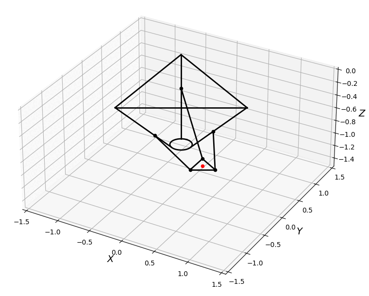

## Delta Robot Kinematics

This repository includes the forward and inverse kinematics of a delta robot with either prismatic or rotational joints.

Requirements:
* Numpy
* Matplotlib

You can find additional information here: 
 - https://www.academia.edu/27264858/Delta_Kin 
 - https://journals.sagepub.com/doi/pdf/10.5772/61744 
 - https://hypertriangle.com/~alex/delta-robot-tutorial/ 
 - https://www.marginallyclever.com/other/samples/fk-ik-test.html
 - https://www.researchgate.net/publication/272747262_DEVELOPMENT_OF_A_PARALLEL_ROBOT_DELTA_KEOPS_WITH_MODIFIED_STRUCTURE

 TODO:
 -  keops delta forward kinematics

